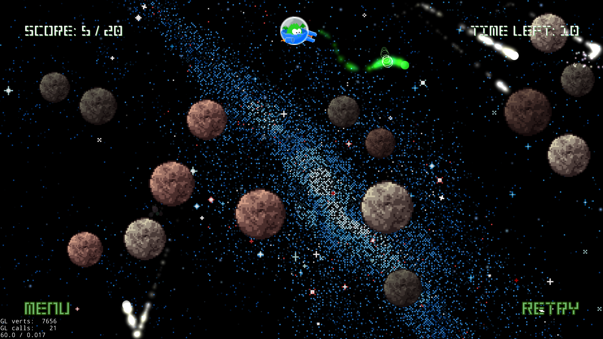
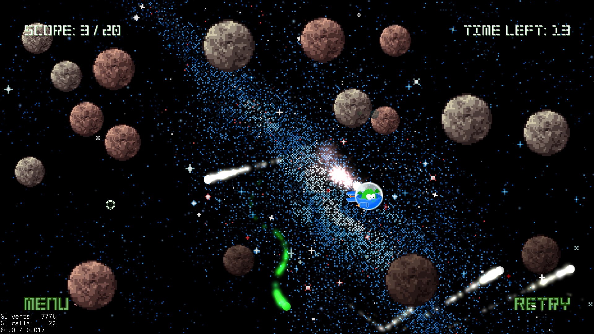
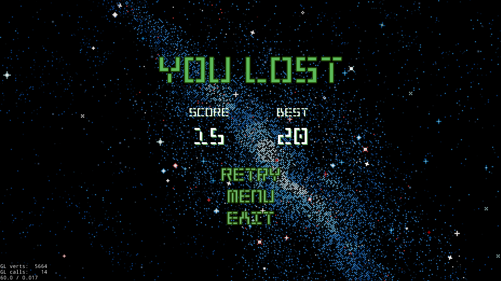

# Gunship

**Gunship** is a game about a... gunship destroying asteroids in space. 

Made with Cocos2d-x. Custom physics engine was implemented.

## Where to play

You can download an archive with an executable of the game for Windows from Google Drive: [link](https://drive.google.com/open?id=1-tQVbULpWIcY4Sdu8Un8RtapW8gn7kFt).

## How to play

You control a gunship.

* Use mouse to aim. 
* Mouse click to shoot.
* Arrows/WASD to move.

**The goal:** destroy all asteroids in time!

## Screenshots

## Influencers

* [Asteroids](https://en.wikipedia.org/wiki/Asteroids_(video_game))

## Disclamer

The game was written as a test project in 2018. It isn't currently updated or maintained.

## License

Copyright 2018 (C) Jan Fazli.

Licensed under the MIT License.
